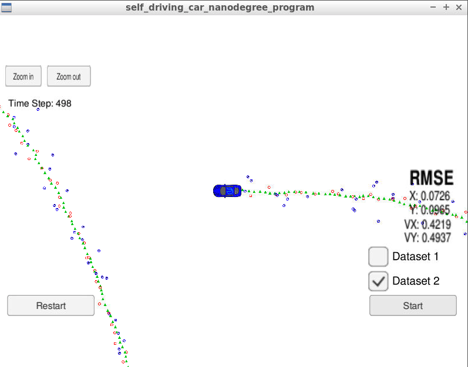

# Extended Kalman Filter Project Starter Code
Self-Driving Car Engineer Nanodegree Program

In this project you will utilize a kalman filter to estimate the state of a moving object of interest with noisy lidar and radar measurements. Passing the project requires obtaining RMSE values that are lower than the tolerance outlined in the project rubric. 

This project involves the Term 2 Simulator which can be downloaded [here](https://github.com/udacity/self-driving-car-sim/releases).

This repository includes two files that can be used to set up and install [uWebSocketIO](https://github.com/uWebSockets/uWebSockets) for either Linux or Mac systems. For windows you can use either Docker, VMware, or even [Windows 10 Bash on Ubuntu](https://www.howtogeek.com/249966/how-to-install-and-use-the-linux-bash-shell-on-windows-10/) to install uWebSocketIO. Please see the uWebSocketIO Starter Guide page in the classroom within the EKF Project lesson for the required version and installation scripts.

Once the install for uWebSocketIO is complete, the main program can be built and run by doing the following from the project top directory.

1. mkdir build
2. cd build
3. cmake ..
4. make
5. ./ExtendedKF

Tips for setting up your environment can be found in the classroom lesson for this project.

Note that the programs that need to be written to accomplish the project are src/FusionEKF.cpp, src/FusionEKF.h, kalman_filter.cpp, kalman_filter.h, tools.cpp, and tools.h

The program main.cpp has already been filled out, but feel free to modify it.

Here is the main protocol that main.cpp uses for uWebSocketIO in communicating with the simulator.


**INPUT**: values provided by the simulator to the c++ program

["sensor_measurement"] => the measurement that the simulator observed (either lidar or radar)


**OUTPUT**: values provided by the c++ program to the simulator

["estimate_x"] <= kalman filter estimated position x

["estimate_y"] <= kalman filter estimated position y

["rmse_x"]

["rmse_y"]

["rmse_vx"]

["rmse_vy"]

---

## Other Important Dependencies

* cmake >= 3.5
  * All OSes: [click here for installation instructions](https://cmake.org/install/)
* make >= 4.1 (Linux, Mac), 3.81 (Windows)
  * Linux: make is installed by default on most Linux distros
  * Mac: [install Xcode command line tools to get make](https://developer.apple.com/xcode/features/)
  * Windows: [Click here for installation instructions](http://gnuwin32.sourceforge.net/packages/make.htm)
* gcc/g++ >= 5.4
  * Linux: gcc / g++ is installed by default on most Linux distros
  * Mac: same deal as make - [install Xcode command line tools](https://developer.apple.com/xcode/features/)
  * Windows: recommend using [MinGW](http://www.mingw.org/)

## Basic Build Instructions

1. Clone this repo.
2. Make a build directory: `mkdir build && cd build`
3. Compile: `cmake .. && make` 
   * On windows, you may need to run: `cmake .. -G "Unix Makefiles" && make`
4. Run it: `./ExtendedKF `

## Editor Settings

We've purposefully kept editor configuration files out of this repo in order to
keep it as simple and environment agnostic as possible. However, we recommend
using the following settings:

* indent using spaces
* set tab width to 2 spaces (keeps the matrices in source code aligned)

## Code Style

Please (do your best to) stick to [Google's C++ style guide](https://google.github.io/styleguide/cppguide.html).

## Generating Additional Data

This is optional!

If you'd like to generate your own radar and lidar data, see the
[utilities repo](https://github.com/udacity/CarND-Mercedes-SF-Utilities) for
Matlab scripts that can generate additional data.

## Project Instructions and Rubric

Note: regardless of the changes you make, your project must be buildable using
cmake and make!

More information is only accessible by people who are already enrolled in Term 2 (three-term version) or Term 1 (two-term version)
of CarND. If you are enrolled, see the Project Resources page in the classroom
for instructions and the project rubric.

### General Algorithm Processing Flow
Below is the general Sensor Fusion Flow, which includes:

 1. Initialization
 2. Predict
 3. Update
 
 

### Initialization

If it is the first measurement, we take the first measurement to initialize the Kalman Filter state `ekf_.x_` and don't perform the predict and update steps.

```
/**
   * Initialization
   */
  if (!is_initialized_) {
    /**
     * TODO: Initialize the state ekf_.x_ with the first measurement.
     * TODO: Create the covariance matrix.
     * You'll need to convert radar from polar to cartesian coordinates.
     */

    // first measurement
    cout << "EKF: " << endl;
    ekf_.x_ = VectorXd(4);
    ekf_.x_ << 1, 1, 1, 1;

    if (measurement_pack.sensor_type_ == MeasurementPackage::RADAR) {
      // TODO: Convert radar from polar to cartesian coordinates 
      //         and initialize state.
      double r = measurement_pack.raw_measurements_[0];
      double phi = measurement_pack.raw_measurements_[1];
      double r_rate = measurement_pack.raw_measurements_[2];
      double x = r * cos(phi);
      double y = r * sin(phi);
      
      if(x < 0.00001) { x = 0.0001;}
      if(y < 0.00001) { y = 0.0001;}
      
      ekf_.x_ << x, 
    	  	     y,
    	  	     r_rate * cos(phi),
    	  	     r_rate * sin(phi);
    }
    else if (measurement_pack.sensor_type_ == MeasurementPackage::LASER) {
      // TODO: Initialize state.
      ekf_.x_ << measurement_pack.raw_measurements_[0], 
      		measurement_pack.raw_measurements_[1], 
      		0,
      		0;
    }
    previous_timestamp_ = measurement_pack.timestamp_;

    // done initializing, no need to predict or update
    is_initialized_ = true;
    return;
  }
  ```

### Predict
Let's say we know an object's current position and velocity , which we keep in the  x  variable. Now one second has passed. We can predict where the object will be one second later because we knew the object position and velocity one second ago; we'll just assume the object kept going at the same velocity.

The  `x' = Fx+ν`  equation does these prediction calculations for us.

But maybe the object didn't maintain the exact same velocity. Maybe the object changed direction, accelerated or decelerated. So when we predict the position one second later, our uncertainty increases.  `P' = F * P * transpose(F)+Q`  represents this increase in uncertainty.

Process noise refers to the uncertainty in the prediction step. We assume the object travels at a constant velocity, but in reality, the object might accelerate or decelerate. The notation  `ν∼N(0,Q)`  defines the process noise as a gaussian distribution with mean zero and covariance `Q`.

In this project, we are assuming the vehicle is running with constant velocity. So the Predict step didn't involve any non-linear process function. Jacobian  Matrix was not applied in Predict step.

```
void KalmanFilter::Predict() {
  
  /**
   * TODO: predict the state
   */
  x_ = F_ * x_;
  MatrixXd Ft = F_.transpose();
  P_ = F_ * P_ * Ft + Q_;
}
```

### Update
Now we get some sensor information that tells where the object is relative to the car. First we compare where we think we are with what the sensor data tells us  `y = z − Hx′`.

The  `K`  matrix, often called the Kalman filter gain, combines the uncertainty of where we think we are  `P′`  with the uncertainty of our sensor measurement  `R`. If our sensor measurements are very uncertain (R is high relative to P'), then the Kalman filter will give more weight to where we think we are:  `x'`. If where we think we are is uncertain (`P'` is high relative to `R`), the Kalman filter will put more weight on the sensor measurement:  `z`.

Measurement noise refers to uncertainty in sensor measurements. The notation  `ω ∼ N(0,R)`  defines the measurement noise as a gaussian distribution with mean zero and covariance `R`. Measurement noise comes from uncertainty in sensor measurements.

```
void KalmanFilter::Update(const VectorXd &z) {
  /**
   * TODO: update the state by using Kalman Filter equations
   */
  
  VectorXd y = z - H_ * x_;
  MatrixXd Ht = H_.transpose();
  MatrixXd S = H_ * P_ * Ht + R_;
  MatrixXd Si = S.inverse();
  MatrixXd K =  P_ * Ht * Si;

  // new state
  x_ = x_ + (K * y);
  MatrixXd I = MatrixXd::Identity(x_.size(), x_.size());
  P_ = (I - K * H_) * P_;
}
```

For the radar measurement, since we introduce the non-linearity while transforming cartesian coordinate to polar coordinate, the Jacobian Matrix will be used to approximate the non-linear function with the help of Taylor Series Expansion. `H_` variable here is already updated with Jacobian Matrix, refer to the function `CalculateJacobian` in file `tools.cpp`.

```
void KalmanFilter::UpdateEKF(const VectorXd &z) {
  /**
   * TODO: update the state by using Extended Kalman Filter equations
   */
  // recover state parameters
  float px = x_(0);
  float py = x_(1);
  float vx = x_(2);
  float vy = x_(3);
  
  float r = sqrt(px * px + py * py);
  float phi = atan2(py, px);
  float r_rate = (px * vx + py * vy) / r;
  
  VectorXd z_pred = VectorXd(3);
  z_pred << r, phi, r_rate;
  
  VectorXd y = z - z_pred;

  while (y(1) > M_PI) y(1) -= 2. * M_PI;
  while (y(1) < -M_PI) y(1) += 2. * M_PI;
  
  // Extended Kalman filter equations 
  MatrixXd Ht = H_.transpose();
  MatrixXd S = H_ * P_ * Ht + R_;
  MatrixXd Si = S.inverse();
  MatrixXd K =  P_ * Ht * Si;

  // new state
  x_ = x_ + (K * y);
  MatrixXd I = MatrixXd::Identity(x_.size(), x_.size());
  P_ = (I - K * H_) * P_;
  
}
```

### Accuracy
From the build directory, execute  `./ExtendedKF`. The output should be:

```
Listening to port 4567
Connected!!!
```
The simulator provides two datasets. The difference between them are:

-   The direction the car (the object) is moving.
-   The order the first measurement is sent to the EKF. On dataset 1, the LIDAR measurement is sent first. On the dataset 2, the RADAR measurement is sent first.

Here is the simulator final state after running the EKL with dataset 1:
  


Here is the simulator final state after running the EKL with dataset 2:



## Hints and Tips!

* You don't have to follow this directory structure, but if you do, your work
  will span all of the .cpp files here. Keep an eye out for TODOs.
* Students have reported rapid expansion of log files when using the term 2 simulator.  This appears to be associated with not being connected to uWebSockets.  If this does occur,  please make sure you are conneted to uWebSockets. The following workaround may also be effective at preventing large log files.

    + create an empty log file
    + remove write permissions so that the simulator can't write to log
 * Please note that the ```Eigen``` library does not initialize ```VectorXd``` or ```MatrixXd``` objects with zeros upon creation.

## Call for IDE Profiles Pull Requests

Help your fellow students!

We decided to create Makefiles with cmake to keep this project as platform
agnostic as possible. Similarly, we omitted IDE profiles in order to ensure
that students don't feel pressured to use one IDE or another.

However! We'd love to help people get up and running with their IDEs of choice.
If you've created a profile for an IDE that you think other students would
appreciate, we'd love to have you add the requisite profile files and
instructions to ide_profiles/. For example if you wanted to add a VS Code
profile, you'd add:

* /ide_profiles/vscode/.vscode
* /ide_profiles/vscode/README.md

The README should explain what the profile does, how to take advantage of it,
and how to install it.

Regardless of the IDE used, every submitted project must
still be compilable with cmake and make.

## How to write a README
A well written README file can enhance your project and portfolio.  Develop your abilities to create professional README files by completing [this free course](https://www.udacity.com/course/writing-readmes--ud777).

